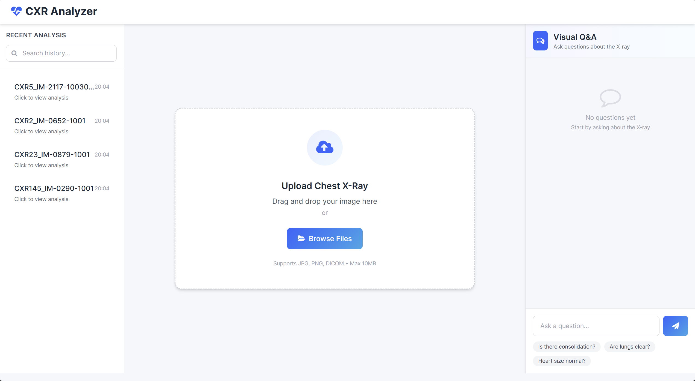
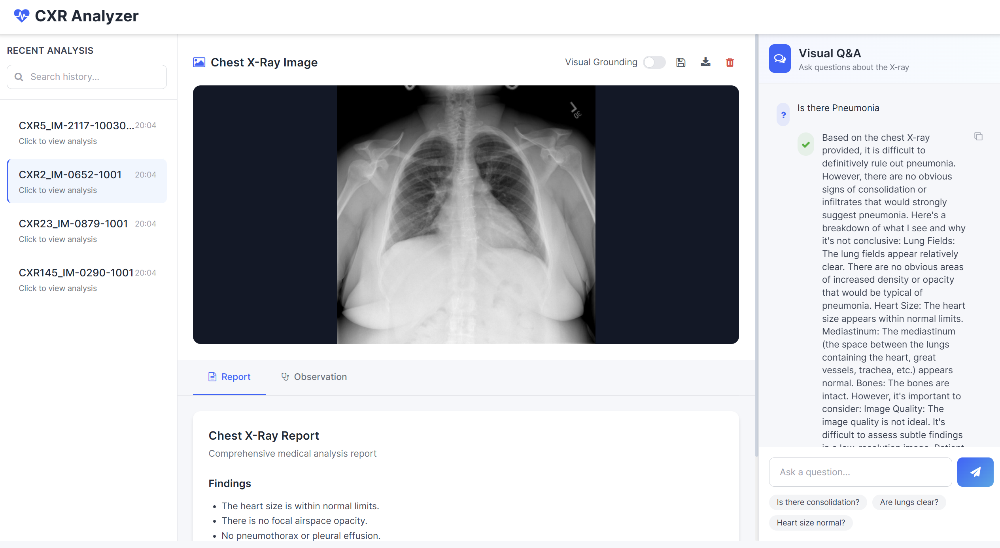
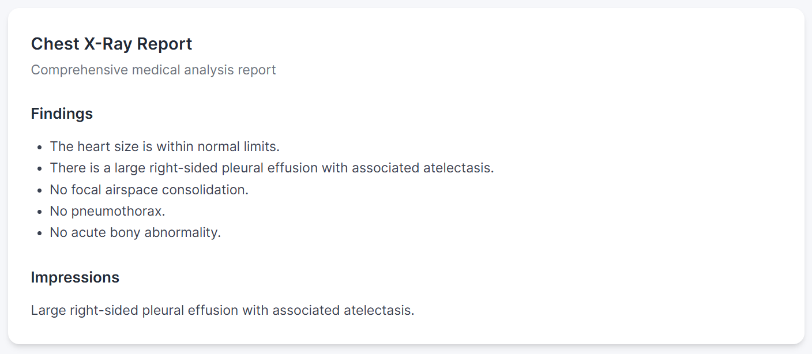
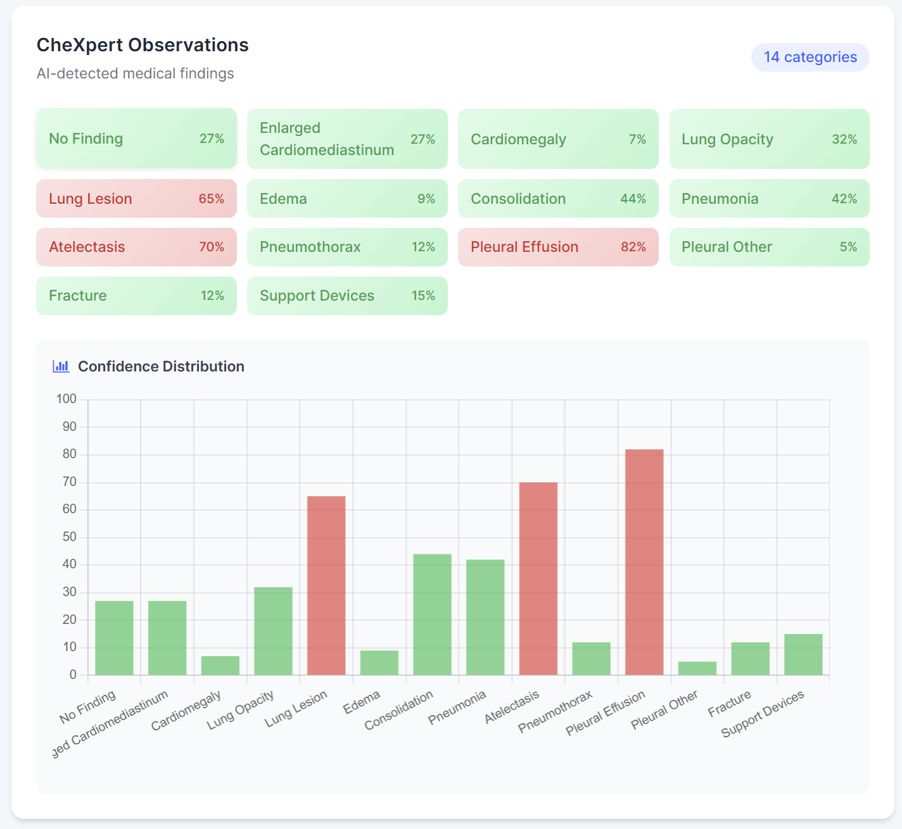
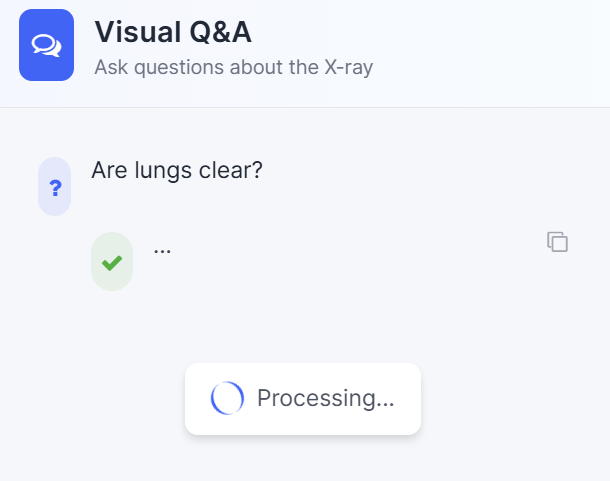
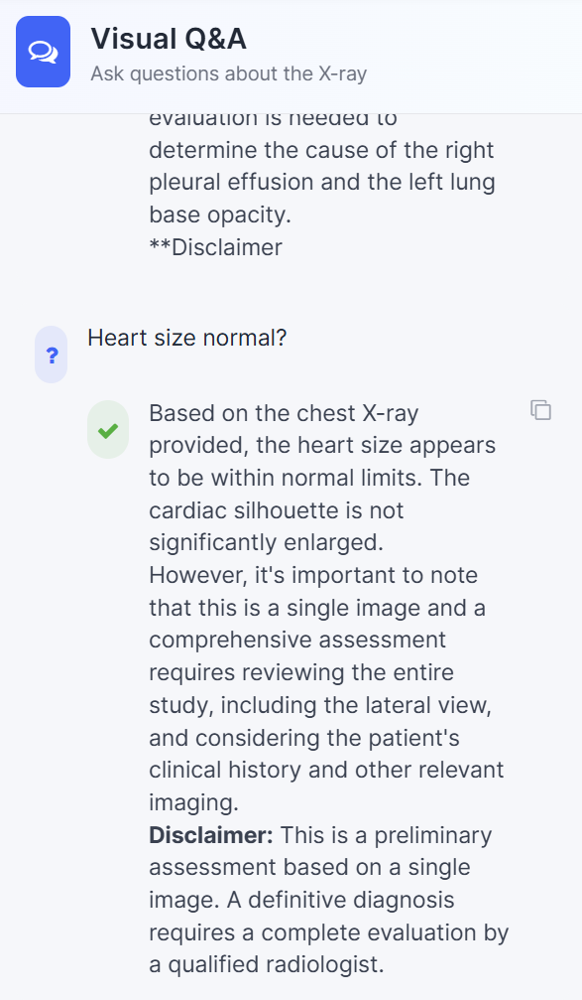
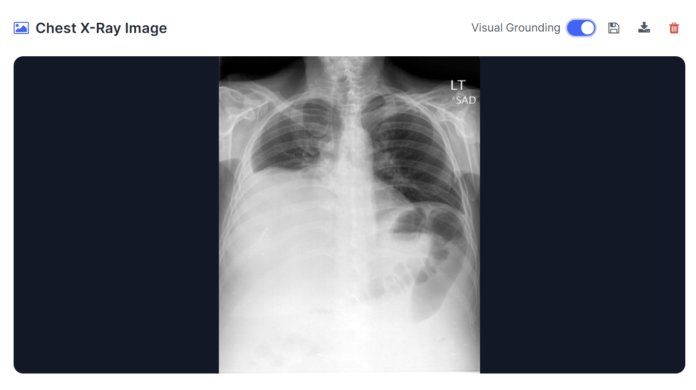
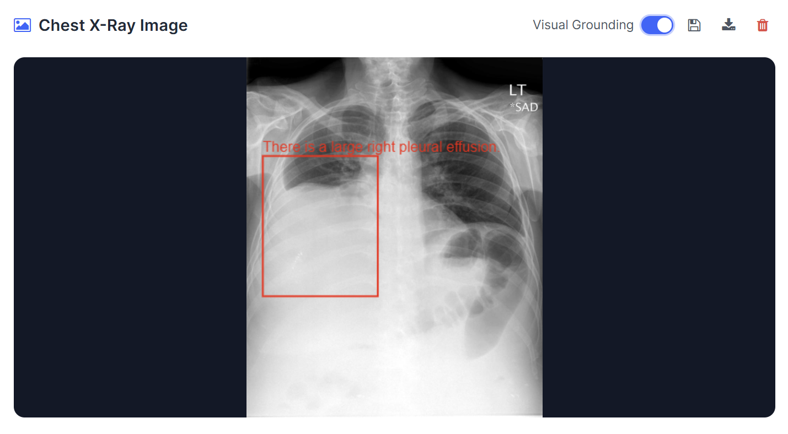

# cxr-analyzer

A Flask-based platform for multi-functional chest X-ray analysis, integrating image classification, report generation, and VQA.

## Table of Contents
- [Features](#features)
- [Installation](#installation)
- [Usage](#usage)
- [Contributing](#contributing)
- [License](#license)

## Features
- Multi-class chest X-ray classification (14 categories)
- Automated grounded report generation
- Phrase-level localization for abnormalities
- Visual Question Answering (VQA) support
- Local history and report saving
- Modular interface for small- and large-scale users

## Installation
1. Clone the repository:
   ```bash
   git clone https://github.com/username/CXR-Analyzer.git
   cd CXR-Analyzer
2. Create and activate a virtual environment:

   ```bash
   conda env create -f environment.yml
   conda activate cxr_env
   ```
3. Run the Flask app:

   ```bash
   python app.py
   ```
5. Open the app in your browser:

   ```
   http://localhost:4090
   ```

## Usage

1. **Initial Page**

   

   - **Research Records (Left):** Search and click to view past analysis, including reports, classification, and VQA answers. All records are stored locally in JSON.  
   - **Image Upload (Middle):** Drag-and-drop or select files for analysis.  
   - **Q&A (Right):** Chat interface with quick question buttons for easy interaction.

2. **Historical Analysis**

   

   - Clear image area with the trash button to start a new analysis.  
   - Save results to access later.  
   - Report tab shows structured X-ray findings; Observation tab shows detected features.

3. **Report and Observations**

     
   

   - Backend loads the model and generates reports automatically.  
   - Observation panel shows 14 categories with confidence bars for quick assessment.

4. **Visual Question Answering (VQA)**

     
   

   - Click common questions to auto-fill chat.  
   - Ask follow-up questions based on historical analysis.  
   - Model returns answers within ~2 minutes.

5. **Grounding Functionality**

     
   

   - Toggle grounding to highlight anatomical regions and key findings with bounding boxes.  
   - Supports visual confirmation of abnormalities.
